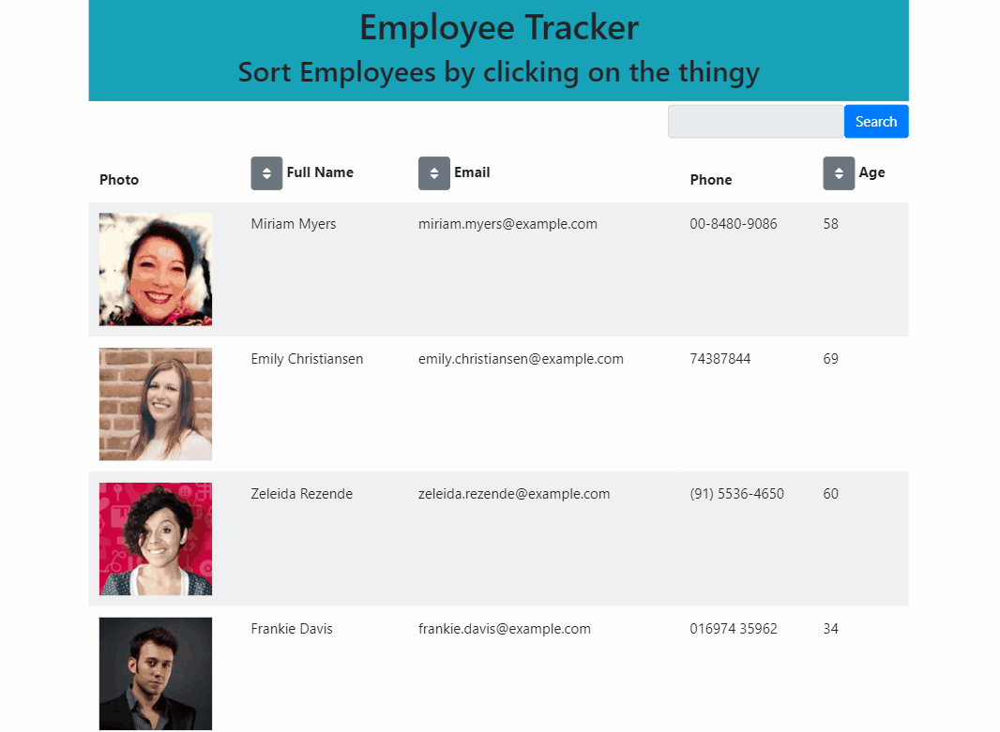

# Employee Direcotry

### Table of Contents
- [Description](#description)
- [Preview](#preview)
- [Questions](#questions)

## Description
This web application is designed to track employees. Employess can be added via JSON  file, and have their information display visually. The user can then sort the employees by email, password, for first name. They is also an option to filter employees by name. There is one small bug, which is the list component will not rerender when the search bar is used. It must require a click on the sort button. 

### Technologies Used
- React 
- Bootstrap

## Preview

## Questions
GitHub: [eddyyangang]()
Deployed Site: [here]()